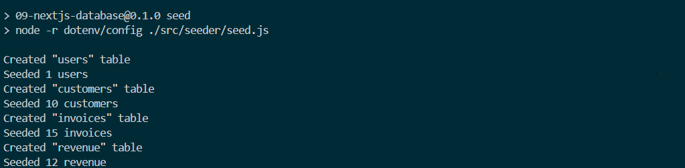

|  | Pemrograman Berbasis Framework 2024 |
| ----------- | --------- |
| NIM | 2141720266 |
| Nama | Alfan Marcel Mulyawan |
| Kelas | TI-3A |

# Soal 1

Deploy project

# Soal 2

# Soal 3

Create table in database

# Soal 4

Try query

# Soal 5

Link : [MyVecelProject](https://09-nextjs-database-kappa-beryl.vercel.app/)

# Soal 6

# Soal 7

# Tugas Praktikum
### 1

### 2
Fungsi tersebut melakukan queri dan mengubahnya dari struktur data menjadi nilai numerik, sehingga nilai tersebut bisa digunakan pada variabel const numberOfInvoices,numberOfCustomers,totalPaidInvoices,totalPendingInvoices.

# 10|Authentication|

# Soal 1
